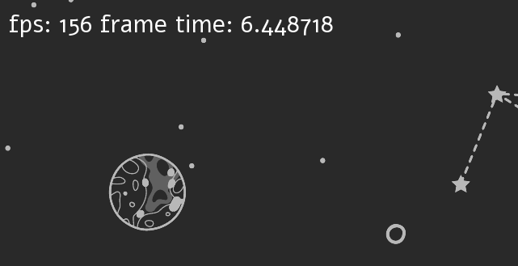
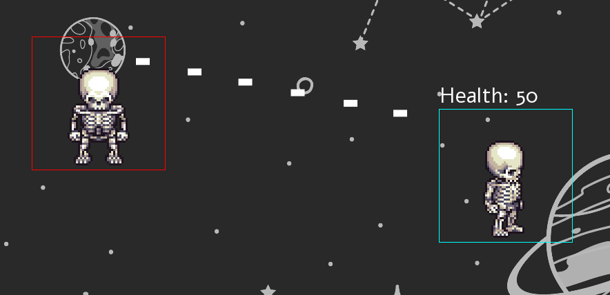
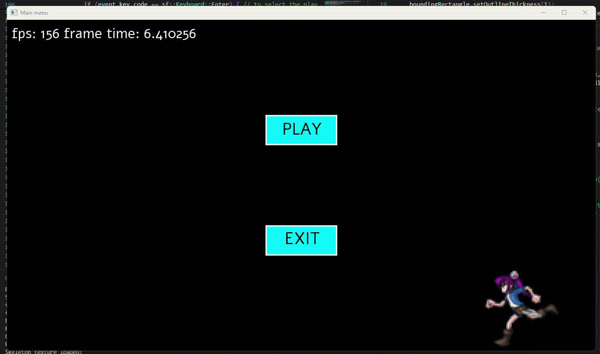
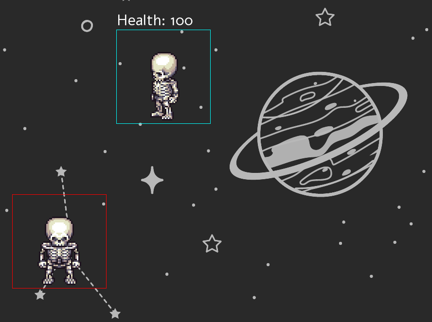

# 🦴 Skeleton Run: 2D SFML Game ⚔️

Welcome to this **Very Basic** sfml game I made.

It's the polished version from the tutorial.

---

## 🎮 Features

- **✨ Pause Menu**:
  - Now with a girl running back and forth to entertain you!
  
- **⚔️ Two-Player Gameplay**:
  - Player 1 (Skeleton A):
    - Move: `WASD`
    - Shoot bullets to damage Player 2! 🎯
  - Player 2 (Skeleton B):
    - Move: `IJKL`
    - Displays health at the top.
    - No shooting but you run!

- **💥 Combat Mechanics**:
  - Player 1 can fire bullets to attack.
  - Player 2 need to dodge and move tactically.
  
- **🌌 Background**:
  - It's just a still image I found online.

---

## 🕹️ Controls

| Player | Action           | Keybindings   |
|--------|------------------|---------------|
| P1     | Move             | `W`, `A`, `S`, `D` |
| P1     | Aim              | `Mouse Pointer` |
| P1     | Shoot Bullets    | `Mouse Left Click`    |
| P2     | Move             | `I`, `J`, `K`, `L` |

---

## 📸 Screenshots

### Main Menu






## 🚀 How to Run the Game

1. Clone this repository:
   ```bash
   git clone https://github.com/yourusername/skeleton-duel.git
   cd skeleton-duel

2. run the game app:
   ```bash
   ./app.exe

## 🌟 Tech Stack
-  Language: C++ (GCC 13.0.0)
-  Library: SFML (Simple and Fast Multimedia Library)
-  Tools: VS Code, MinGW

## 🤝 Contributing
Feel free to fork this repository, create a feature branch, and submit a pull request. All contributions are welcome! 🎉

## 📜 License
This project is licensed under the MIT License.

## Created with ❤️ by Aditya
